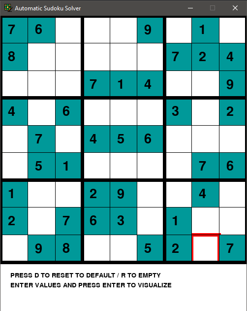
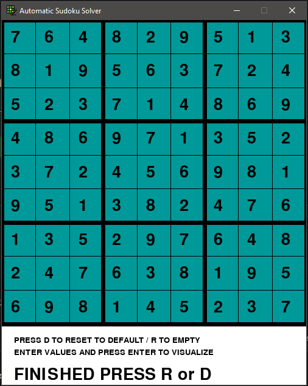

# Automatic-Sudoku-Solver-using-pygame
This sudoku game is developed using pygame library and automated using backtracking algorithm

## Features implemented
**Game Interface to Play**  
**Auto solving**  
**Visualization of auto solving i.e., Backtracking Algorithm visualization**  
**Options: Reset, Clear game**  
**Manual Solving**  

## Screenshots
  

