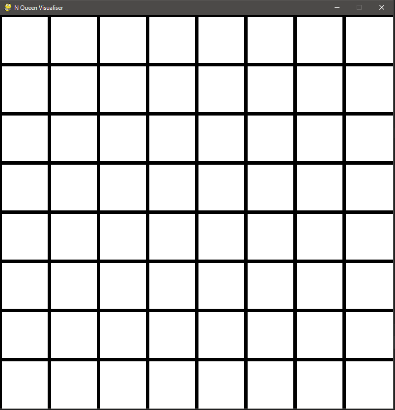
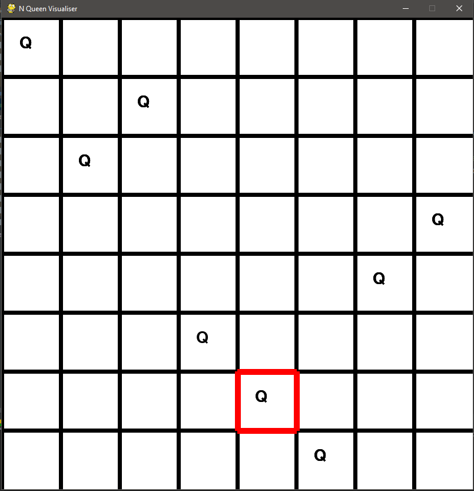
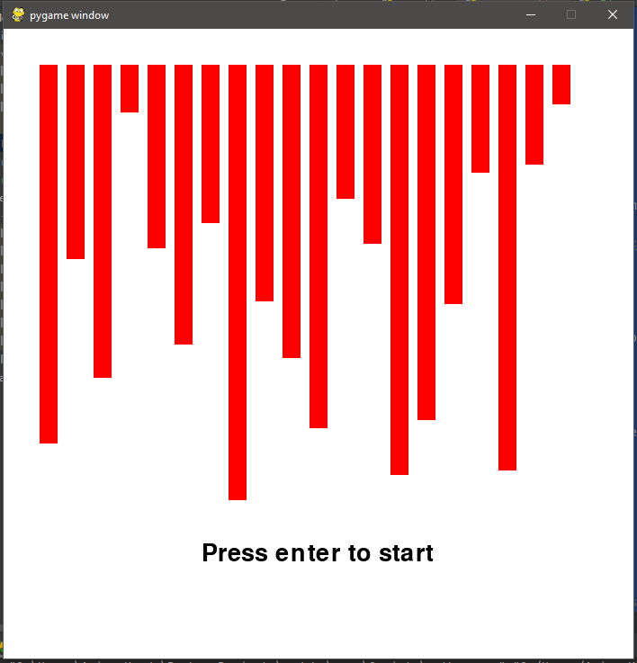
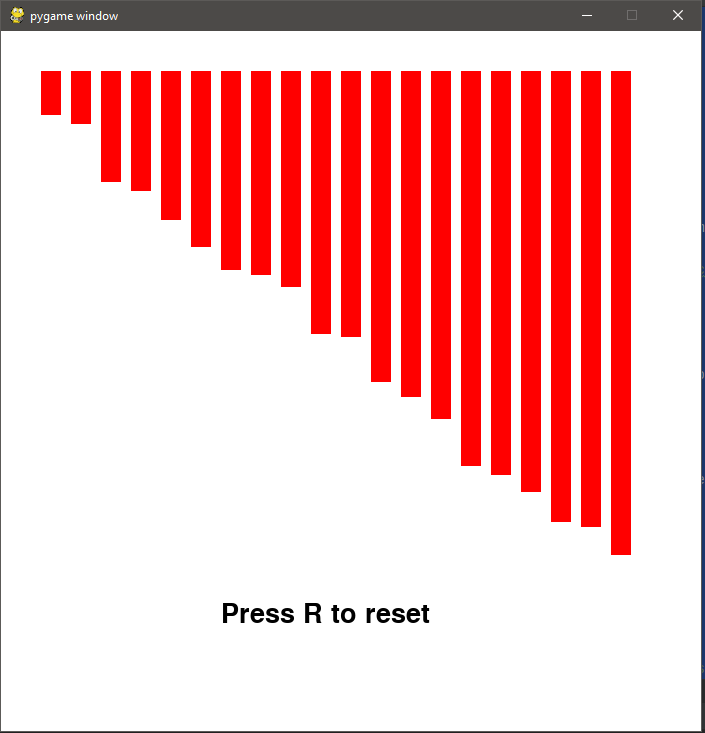
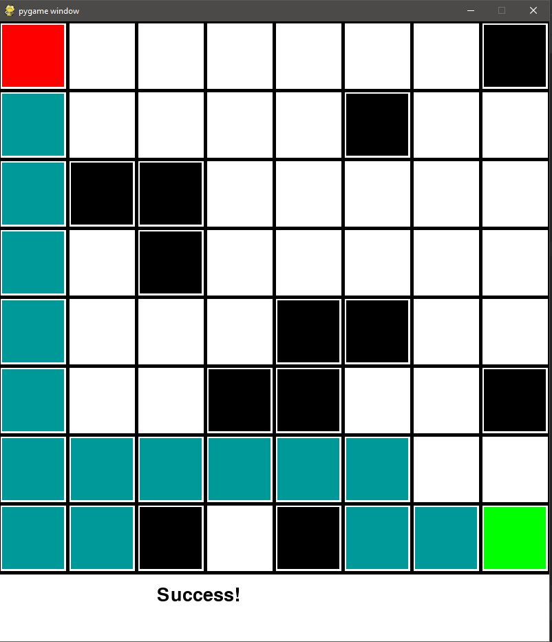

# Algo-visualiser

## Sudoku
Sudoku is a logic-based, combinatorial number-placement puzzle. In classic sudoku, the objective is to fill a 9×9 grid with digits so that each column, each row, and each of the nine 3×3 subgrids that compose the grid contain all of the digits from 1 to 9. This sudoku game is developed using pygame library and automated using backtracking algorithm

### Features implemented
1) **Game Interface to Play** <br/>
2) **Auto solving** <br/>
3) **Visualization of auto solving i.e., Backtracking Algorithm visualization** <br/>
4) **Options: Reset, Clear game** <br/>
5) **Manual Solving** <br/>

### Screenshots
  

### Time and Space Complexity
Time complexity of backtracking algorithm is ```O(N^(N * N))``` where N is the grid size <br/>
Space complexity is ```O(N * N)```

## N Queen
The eight queens puzzle is the problem of placing eight chess queens on an 8×8 chessboard so that no two queens threaten each other; thus, a solution requires that no two queens share the same row, column, or diagonal

### Features Implemented
1) **Backtracking Visualisation** <br/>
2) **Auto Solving** <br/>

### Screenshots
  

### Time and Space Complexity
Time complexity of backtracking algorithm is ```O(N^N)``` where N is the grid size <br/>
Space complexity is ```O(N * N)```

## Bubble sort visualiser
Bubble sort, sometimes referred to as sinking sort, is a simple sorting algorithm that repeatedly steps through the list, compares adjacent elements and swaps them if they are in the wrong order. The pass through the list is repeated until the list is sorted.

### Screenshots
  

### Time Complexity
Time complexity of bubble sort is ```O(N*N)```

## DFS
Depth-first search is an algorithm for traversing or searching tree or graph data structures. The algorithm starts at the root node and explores as far as possible along each branch before backtracking. <br/>
DFS traverses the graph depthwise. when it reaches a dead end, it backtracks and continues the process

### Features
Add source, destination, obstacles and visualise DFS!

### Screenshots

